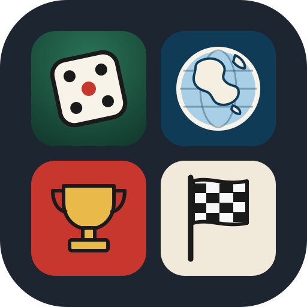

# DesDés

Plate-forme web (application installable) qui regroupe nos carnets de score de jeux de dés, un quiz de géographie, une course à dessiner et un jeu de neige de culture en 3D.



## Les carnets

| Jeu | Fichier | Joueurs |
| --- | --- | --- |
| **10 000** : ouverture à 1 000, croix (effacées dès qu'on note des points ou le −500 du 1er lancer), reprises, pénalités ; il faut finir à 10 000 pile, dépasser donne une croix, et on ne peut pas reprendre des points qui mèneraient à 10 000 ou plus | `jeux/10000.html` | 2 à 15 |
| **Yam's** : feuille de marque classique, bonus à 63 | `jeux/yams.html` | 1 à 10 |
| **Géographie** : drapeaux et placement des pays sur la carte, par continent ou le monde, avec chrono et records | `jeux/geo.html` | 1 |
| **Draw Race** : course de monoplaces dont on dessine la trajectoire, 10 circuits inspirés de la F1 | `jeux/drawrace.html` | 1 à 4 (+ adversaires) |
| **Nivoculteur** : construire et faire tourner le réseau de neige de culture d'une station, en 3D (en construction) | `jeux/nivoculteur/index.html` | 1 |

La page d'accueil (`index.html`) permet de choisir un carnet et indique si une partie est en cours (qui mène, à qui c'est le tour).
Chaque partie est enregistrée dans le navigateur de l'appareil : on peut quitter un jeu et le reprendre plus tard.

## Plateau de dés

Si on a oublié les dés, le bouton rouge **Dés** de chaque carnet ouvre un tapis avec 5 dés : on les lance en glissant le doigt sur le tapis (ou avec le bouton *Lancer*), et on touche un dé pour le garder.

- **Yam's** : 3 lancers au plus par tour ; on garde ou reprend les dés de son choix entre deux lancers.
  Après chaque lancer, le plateau reconnaît les figures (brelan, full, suites, Yam's…) et propose les cases libres du joueur avec leurs points ; un toucher note le score dans la feuille. On peut aussi rayer une case.
- **10 000** : lancers sans limite ; il faut mettre de côté au moins un dé qui rapporte avant de relancer (bouton pour mettre de côté tout ce qui compte). Les points passent dans le tour du carnet à chaque relance, et « Garder les points » les inscrit.
  - Si tous les dés lancés rapportent, les points sont ajoutés et la relance des 5 dés est obligatoire.
  - Si les 2 derniers dés font un double (2, 3, 4 ou 6), relance obligatoire des 5 dés, sans points. Un double 1 ou 5 rapporte ses points, puis relance des 5.
  - Si aucun dé ne rapporte, le plateau propose de noter le raté.
  - Quand un joueur reprend les points du précédent, il ne lance que les dés que celui-ci avait laissés (par exemple 2 dés pour 2 700 points gardés avec 2 dés restants). Il doit lancer et marquer des points avant de pouvoir garder : on ne peut pas reprendre un score et le noter sans jouer (règle appliquée aussi dans le carnet).

Les dés ne se chevauchent jamais sur le tapis : après chaque lancer, ceux qui se touchent sont légèrement écartés.

Le plateau repart de zéro dès qu'un score est noté dans le carnet. Le code est dans `jeux/plateau.js`, partagé par les deux jeux.

## Géographie

Deux jeux, pour le monde entier (195 pays : membres de l'ONU, Vatican et Palestine) ou un continent :

- **Drapeaux** : un drapeau et quatre pays du même continent ; il faut trouver le bon.
- **Carte** : un nom de pays ; il faut le toucher sur la carte (on peut zoomer en pinçant ou avec les boutons, et se déplacer en glissant). Trois essais par pays, puis la réponse s'affiche. Les tout petits pays ont un repère rond pour pouvoir les toucher.

Le chrono tourne pendant toute la partie. Les 5 meilleurs résultats de chaque jeu et de chaque zone sont gardés sur l'appareil (score du premier coup, puis temps).

Les données (`jeux/geo/monde.js` et `jeux/geo/drapeaux/`) sont produites par `outils/construire-geo.mjs` à partir de : Natural Earth via world-atlas (domaine public), mledoze/countries via world-countries (licence ODbL), drapeaux flag-icons (licence MIT), noms français du CLDR.

## Draw Race

Le jeu se joue le téléphone à l'horizontale (un message le demande en vertical), pour des pistes plus larges.

1. On choisit le nombre de joueurs (1 à 4, sur le même appareil), la couleur de chaque monoplace, le niveau des adversaires, puis le circuit dans le carrousel (10 circuits inspirés de la F1, difficulté de 1 à 5, de 2 à 5 tours).
2. Chaque joueur dessine ses tours d'affilée, sans lever le doigt, en partant de la ligne à damier (on peut reprendre au bout du trait, ou tout recommencer). La vitesse du doigt devient la vitesse de la voiture : la jauge et la couleur du trait passent du vert (lent) au rouge (rapide). Dans les virages, la voiture ralentit toute seule : pas de dérapage.
3. La course se joue à 4 voitures (les places libres sont prises par des adversaires, qui partent derrière les joueurs). Chaque voiture suit, à chaque tour, le tracé dessiné pour ce tour. Chaque joueur a 3 Boosts (vitesse ×1,4 pendant 1,3 s). On peut abandonner à tout moment (la partie ne compte pas).

Hors piste, la voiture ralentit. Les virages sont bordés de vibreurs rouge et blanc. Les records (5 meilleurs temps et meilleur tour) sont gardés par circuit.
Les circuits sont dans `jeux/drawrace/circuits.js` (points de passage), la géométrie dans `jeux/drawrace/piste.js`.

## Nivoculteur

Jeu 3D (Three.js) sur le métier de nivoculteur : construire le réseau (regards, canons, conduites, câbles) avec un budget, produire la neige la nuit, gagner de l'argent avec la neige tombée sur la piste.
Il est construit étape par étape ; le projet, les règles et l'avancement sont décrits dans `jeux/nivoculteur/CLAUDE.md`.

- La page `jeux/nivoculteur/index.html` charge les scripts du dossier `jeux/nivoculteur/js/` ; le jeu s'ouvre aussi seul, en double-cliquant sur la page, sur un ordinateur (garder le dossier entier).
- `three.min.js` (Three.js 0.149.0, licence MIT) est posé à côté pour jouer sans internet.
- Tous les chiffres réglables (prix, pressions, débits, durées, vent) sont dans `js/config.js` (`CONFIG`, catalogue des enneigeurs et supports), les niveaux dans `js/niveaux.js`.
- Nuits (60 s = 12 h) : « Lancer la nuit » (barre du bas ou poste de travail) fait produire les canons prêts ; le vent déporte la neige, seule la neige tombée sur la piste rapporte ; la retenue se vide. Toucher un regard ouvre sa fiche, à gauche sur grand écran ou en volet du bas sur téléphone, et centre la vue sur le canon (curseurs de direction et d'inclinaison, jauge de pression, remplacement de l'enneigeur). Quand l'objectif est atteint, une dameuse prépare la piste.
- Poste de travail (bouton, ou toucher l'écran du pupitre dans la salle de pompage) : pompes en automatique ou en manuel, vanne principale, pressions, alarmes, et marche/arrêt de chaque canon.
- Carrière : une station qui grandit en 20 étapes (réseau et argent gardés) ; chaque étape demande des m³ sur les pistes et des recettes en un nombre de nuits, et débloque du matériel (pompes, canons, tours, compresseur, perches), puis viennent les pannes.
- Tutoriels : un menu permet de choisir le niveau 1 (la salle de pompage : pompes et vanne à la main, sans coup de bélier) le niveau 2 (construire le réseau) le niveau 3 (les perches et l'air comprimé : outil « Air » depuis le compresseur, compresseur piloté au poste, électricité facturée chaque nuit) le niveau 4 (les pannes : fuites, moteurs, buses gelées, disjoncteurs, pompes, à réparer depuis le poste de travail), ou le bac à sable (tout débloqué ; outils Piste et Remontée pour tracer ses pistes et poser des télésièges ; bouton Options : argent illimité ou non, vent, pannes et leurs types, eau et électricité payantes ou non). Les pannes en cours s'affichent dans le coin en haut à droite. L'eau remise chaque jour dans la retenue est payante. La partie et les niveaux réussis sont gardés sur l'appareil (clés `nivo-partie-…` et `nivo-progression`). Les débits sont en m³/h.
- Construction : outils « + Regard », « Eau » (depuis la salle de pompage ou un regard alimenté), « Électricité » (depuis un départ électrique près des bâtiments ou un regard alimenté) ; un devis s'affiche avant chaque achat (tranchée commune moins chère, pression prévue) ; vue sous-sol, annuler, tout effacer.
- `index.html?test` affiche les vérifications de la simulation ; `index.html?modeles` (bouton « Modèles 3D ») montre chaque modèle 3D seul : ventilateurs, perches, regard, salle de pompage, compresseur d'air, dameuse, armoire électrique.

## Mise en ligne

Le site est fait de fichiers statiques, sans installation ni compilation.
Avec GitHub Pages : *Settings → Pages → Deploy from a branch*, choisir la branche `main` et le dossier `/ (root)`.

Pour l'installer sur un téléphone : ouvrir le site, puis *Partager → Sur l'écran d'accueil* (iPhone) ou *Installer l'application* (Android).
Une fois ouvert une première fois, il fonctionne aussi sans réseau.

## Ajouter un jeu

1. Déposer le carnet dans `jeux/` (un fichier HTML autonome).
2. Y ajouter le lien de retour `<a class="home" href="../index.html">…</a>` et les balises du manifeste, comme dans les deux carnets existants.
3. Ajouter sa carte dans `index.html`.
4. Ajouter le fichier à la liste `SHELL` de `sw.js` et changer `VERSION` pour que les téléphones récupèrent la mise à jour.

## Fichiers

```
index.html             accueil : choix du jeu
jeux/10000.html        carnet du 10 000
jeux/yams.html         feuille de Yam's
jeux/plateau.js        plateau de 5 dés à lancer, commun aux deux jeux
jeux/geo.html          jeu de géographie
jeux/geo/              données de la carte et drapeaux
outils/                script qui fabrique les données de géographie
jeux/drawrace.html     jeu Draw Race
jeux/drawrace/         circuits et géométrie de Draw Race
jeux/nivoculteur/      jeu Nivoculteur (page, Three.js, CLAUDE.md)
logo.svg               logo (source vectorielle)
icons/                 icônes de l'application (192, 512, masquable, Apple)
manifest.webmanifest   description de l'application installable
sw.js                  fonctionnement hors ligne
```
